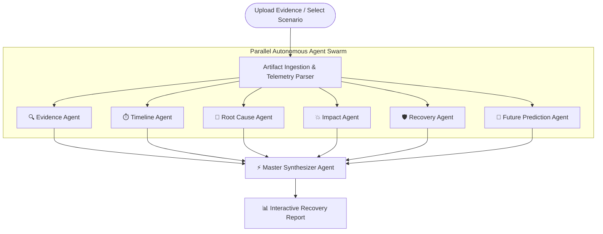

# WindCover AI – AI-Powered Crisis Intelligence & Recovery Platform

> **An ASI:ONE-inspired autonomous crisis intelligence and recovery prototype.**

WindCover AI acts as a recovery intelligence platform for any enterprise crisis. Whether experiencing a ransomware breach, startup funding collapse, customer data leak, viral disinformation campaign, or critical contract dispute, WindCover AI deploys six specialized autonomous agents in parallel to reconstruct what happened, analyze root causes, and build recovery intelligence playbooks in real-time.

---

## ⚡ Key Features

* **Multi-Agent Autonomous Crisis Intelligence**: Parallel execution of 6 specialist AI agents (*Evidence, Timeline, Root Cause, Impact, Recovery, Future Prediction*) managed by a central Master Synthesizer Agent.
* **Mission Control Telemetry Console**: Real-time streaming terminal logs with microsecond timestamping and model confidence tracking.
* **Crisis Severity & Blast Radius Engine**: Automated calculation of 0-100 severity index, financial damage projections, affected endpoint counts, and recovery difficulty scores.
* **Interactive 8-Section Recovery Dossier**:
  1. Executive Summary
  2. Chronological Timeline Reconstruction Map
  3. Five-Whys Root Cause Vulnerability Decomposition
  4. Blindspots & Hidden Risk Exposure
  5. Multi-Vector Impact Assessment
  6. Immediate 24-Hour Action Plan (Interactive Checklists)
  7. Medium-Term 7-Day Hardening Plan
  8. Future Risk Predictive Intelligence
* **Executive Report Exports**: One-click generation of institutional print-ready PDFs and downloadable offline HTML dossiers.

---

## 📐 Architecture & Agent Workflow



---

## 🚀 Getting Started Locally

### Prerequisites
* Node.js 18.x or higher
* npm or pnpm / yarn

### Installation & Run

1. Clone the repository and install dependencies:
```bash
npm install
```

2. Launch the dev server:
```bash
npm run dev
```

3. Open [http://localhost:3000](http://localhost:3000) in your browser to access the WindCover AI Mission Control.

---

## 🛠️ Technology Stack

* **Framework**: Next.js 16 (App Router) & React 19
* **Styling**: Tailwind CSS v4 & Glassmorphism UI Components
* **Animations**: Framer Motion
* **Iconography**: Lucide React
* **Orchestration Model**: Prototype demonstrating ASI:ONE-style autonomous multi-agent workflows.
