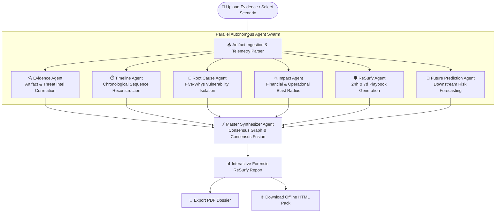

# 🛡️ WindSurf AI – Autonomous Crisis Intelligence & ReSurfy Platform

> **An ASI:ONE-inspired multi-agent crisis investigation, blast-radius calculation, and reSurfy intelligence engine.**

[](https://nextjs.org/)
[](https://react.dev/)
[](https://tailwindcss.com/)
[](https://www.framer.com/motion/)
[](#-architecture--agent-swarm-workflow)

---

## 📑 Table of Contents

- [ Overview](#-overview)
- [⚡ Key Features](#-key-features)
- [📐 Architecture & Agent Swarm Workflow](#-architecture--agent-swarm-workflow)
- [🤖 The 6 Autonomous Specialist Agents](#-the-6-autonomous-specialist-agents)
- [📊 Interactive 8-Section Forensic Dossier](#-interactive-8-section-forensic-dossier)
- [🎮 Built-in Crisis Simulation Benchmarks](#-built-in-crisis-simulation-benchmarks)
- [🛠️ Technology Stack](#️-technology-stack)
- [📁 Repository Directory Structure](#-repository-directory-structure)
- [🚀 Getting Started & Installation](#-getting-started--installation)
- [📖 User Guide & Operational Workflow](#-user-guide--operational-workflow)
- [⚙️ Customization & Extension](#️-customization--extension)
- [📄 License](#-license)

---

## 🌟 Overview

**WindSurf AI** is an enterprise-grade crisis intelligence and automated reSurfy platform designed to assist executives, security operations teams, legal counsel, and incident managers during high-stakes corporate emergencies.

When critical incidents occur—such as ransomware breaches, sudden venture funding collapses, customer data leaks, coordinated AI deepfake disinforamtion campaigns, or vendor IP injunctions—organizations often face information overload and chaos. 

WindSurf AI instantly deploys **six autonomous AI specialist agents in parallel** to ingest unstructured incident artifacts, parse live telemetry, isolate root causes, quantify financial and operational damage, build actionable 24-hour and 7-day playbooks, and forecast future downstream fallout.

---

## ⚡ Key Features

### 🔍 1. Multi-Agent Autonomous Swarm Architecture
Parallel execution of 6 specialized autonomous agents (*Evidence, Timeline, Root Cause, Impact, ReSurfy, Future Prediction*) coordinated by a central **Master Synthesizer Agent** that resolves contradictory telemetry into a unified consensus graph.

### 💻 2. Mission Control Telemetry Console
Real-time streaming terminal logs with microsecond precision timestamping, active stage monitoring, and individual agent confidence scores (0-100%).

### 📈 3. Crisis Severity & Blast Radius Engine
Algorithmic quantification of crisis severity (0–100 scale), immediate financial exposure estimates, affected system/endpoint counts, impacted user counts, and reSurfy difficulty scoring.

### 📋 4. Interactive 8-Section Forensic ReSurfy Dossier
Comprehensive incident breakdowns featuring interactive action checklists, 5-Whys root cause trees, multi-vector impact matrices, and predictive risk probability gauges.

### 📄 5. Institutional PDF & HTML Export Suite
One-click generation of institutional-ready, print-formatted PDF reports and standalone downloadable HTML dossiers formatted for C-suite executives, board members, and legal underwriters.

### 📁 6. Universal Evidence Ingestion Locker
Drag-and-drop ingestion supporting system logs, network traffic CSVs, Terraform code diffs, legal court notices, financial balance sheets, and raw incident notes.

---

## 📐 Architecture & Agent Swarm Workflow

The following diagram illustrates how raw incident telemetry flows from initial ingestion through parallel multi-agent analysis to the final Master Synthesizer consensus report:



---

## 🤖 The 6 Autonomous Specialist Agents

| Agent Icon | Agent Name | Primary Responsibility & Analytical Focus | Output Contribution |
| :---: | :--- | :--- | :--- |
| 🔍 | **Evidence Agent** | Parses log snippets, network captures, legal filings, and code diffs to extract key indicators of compromise (IOCs) and evidence artifacts. | Verified Evidence Inventory & Artifact Extracts |
| ⏱️ | **Timeline Agent** | Reconstructs precise chronological sequences (T-minus to T-plus) tracking pre-incident indicators and initial breach times. | Chronological Incident Timeline Map |
| 🎯 | **Root Cause Agent** | Performs systemic 5-Whys vulnerability decomposition to isolate architectural flaws and procedural blindspots. | Root Cause & Vulnerability Analysis |
| 💥 | **Impact Agent** | Evaluates multi-dimensional damage across Financial, Reputational, Operational, and Legal risk vectors. | Blast Radius & Multi-Vector Damage Matrix |
| 🛡️ | **ReSurfy Agent** | Formulates rapid 24-hour containment checklists and 7-day structural infrastructure hardening playbooks. | Interactive ReSurfy Action Plans |
| 🔮 | **Future Prediction Agent** | Runs predictive probability simulations for secondary fallout (e.g., darknet leaks, regulatory fines, class-action suits). | Downstream Risk Forecast Gauge |

---

## 📊 Interactive 8-Section Forensic Dossier

When analysis completes, WindSurf AI delivers a full 8-section interactive dossier located at `/incident`:

1. **Executive Summary**: High-level incident briefing tailored for board members and executive leaders.
2. **Chronological Timeline Reconstruction**: Visual event stream categorized by severity (`critical`, `warning`, `info`, `resolved`).
3. **Five-Whys Root Cause Decomposition**: Granular breakdown of primary ingress points and privilege escalation vectors.
4. **Blindspots & Hidden Risk Exposure**: UnSurfed perimeter vulnerabilities, secondary backdoors, and compliance traps.
5. **Multi-Vector Impact Assessment**: Detailed breakdown across Financial, Reputational, Operational, and Legal dimensions.
6. **Immediate 24-Hour Containment Plan**: Interactive checklist for emergency isolation, credential revocation, and PR stabilization.
7. **Medium-Term 7-Day Hardening Plan**: Structural remediation roadmap Surfing Zero-Trust architecture and policy rewrites.
8. **Future Risk Predictive Intelligence**: Timeframed probability matrix anticipating downstream legal, financial, and regulatory events.

---

## 🎮 Built-in Crisis Simulation Benchmarks

WindSurf AI comes pre-loaded with five enterprise crisis benchmark scenarios for instant testing and demonstration:

### 1. 🔒 Enterprise Ransomware & Data Exfiltration Incident
* **Category**: Cybersecurity Breach | **Severity**: Catastrophic (94/100)
* **Description**: LockBit 3.0 strain compromised primary Active Directory servers via a hijacked zero-day VPN credential, locking core ERP databases and exfiltrating 450GB of customer financial telemetry.
* **Financial Exposure**: $4.8M – $12.5M | **Systems Impacted**: 142 endpoints.

### 2. 💸 Series B Term Sheet Revocation & Liquidity Crisis
* **Category**: Financial Crisis | **Severity**: Critical (88/100)
* **Description**: Lead investor revoked a $25M Series B term sheet 48 hours prior to wiring deadline due to macro liquidity tightening and audit flags regarding customer concentration.
* **Financial Exposure**: $25.0M Funding Shortfall | **Runway Remaining**: 24 Days.

### 3. ☁️ Cloud Storage Bucket Misconfiguration & PII Exfiltration
* **Category**: Data Privacy Breach | **Severity**: High (82/100)
* **Description**: An AWS S3 analytics data bucket containing 3.4M unencrypted customer KYC records was left publicly readable for 14 days due to an automated Terraform deployment flaw.
* **Financial Exposure**: $2.2M – $6.5M | **People Affected**: 3.4 Million Users.

### 4. 🤖 Coordinated Botnet Disinformation & CEO Deepfake Attack
* **Category**: Reputational Warfare | **Severity**: Critical (86/100)
* **Description**: Coordinated viral campaign utilizing AI deepfake audio and 15,000 automated social media accounts falsely alleging executive arrest and insolvency, driving a 22% stock sell-off.
* **Financial Exposure**: $18.4M Market Cap Loss | **People Affected**: 150,000 Shareholders.

### 5. ⚖️ Critical Vendor Injunction & IP Ownership Deadlock
* **Category**: Legal & Operational Crisis | **Severity**: High (79/100)
* **Description**: Joint-venture partner filed an emergency court injunction freezing access to proprietary machine learning model weights, claiming sole IP ownership and unpaid royalties.
* **Financial Exposure**: $3.5M Operational Delay | **Systems Impacted**: Core AI Inference APIs.

---

## 🛠️ Technology Stack

* **Core Framework**: [Next.js 16.2](https://nextjs.org/) (App Router & React Server Components)
* **UI Engine**: [React 19.2](https://react.dev/)
* **Styling & Design System**: [Tailwind CSS v4](https://tailwindcss.com/) with dark-mode glassmorphism styling (`#050505` futuristic palette)
* **Animation & Motion**: [Framer Motion 12.4](https://www.framer.com/motion/) for micro-interactions, modal transitions, and live workflow nodes
* **Iconography**: [Lucide React](https://lucide.dev/)
* **Diagramming**: [Mermaid.js](https://mermaid.js.org/)

---

## 📁 Repository Directory Structure

```
windSurf-ai/
├── app/
│   ├── api/                  # API endpoints and background synthesis handlers
│   ├── dashboard/            # Mission Control Telemetry Console (/dashboard)
│   ├── incident/             # Interactive Forensic Report Dossier (/incident)
│   ├── globals.css           # Custom Tailwind v4 styling tokens & glowing animation utility classes
│   ├── layout.js             # Root application wrapper with IncidentProvider context
│   └── page.tsx              # Landing page featuring hero, interactive upload locker & scenarios
├── components/
│   ├── ActionPlan.jsx        # Interactive checklist component for 24h/7d reSurfy plans
│   ├── AgentCard.tsx         # Individual agent telemetry status card with live logs & metrics
│   ├── AnimatedWorkflow.tsx  # Dynamic topology map showing active agent messaging nodes
│   ├── IncidentTimeline.tsx  # Chronological incident reconstruction component
│   ├── MasterSynthesizerModal.tsx # Fullscreen modal showing real-time consensus synthesis sequence
│   ├── MetricsPanel.tsx      # Top-level blast radius gauge bar (Severity, Financial, Endpoints)
│   ├── ReportSection.tsx     # Comprehensive 8-section forensic report viewer with PDF/HTML export
│   ├── TerminalLogs.tsx      # Streaming terminal log window with color-coded syntax highlighting
│   └── UploadZone.tsx        # Drag-and-drop evidence locker supporting file drops & custom text
├── lib/
│   ├── export.js             # Client-side HTML/PDF dossier generation algorithms
│   ├── incident-context.tsx  # Global state manager for active scenarios, streaming logs & stage machines
│   ├── mock-agents.ts        # Telemetry generators for Evidence, Timeline, Root Cause, Impact, ReSurfy & Prediction agents
│   ├── mock-incidents.ts     # Pre-configured crisis simulation benchmarks & evidence datasets
│   └── report-builder.ts     # Master synthesizer report aggregation functions
├── public/                   # Static assets, logos, and favicons
├── package.json              # Project dependencies and script configurations
├── tailwind.config.mjs       # Tailwind configuration (if applicable)
├── tsconfig.json             # TypeScript compiler settings
└── README.md                 # Project documentation
```

---

## 🚀 Getting Started & Installation

### Prerequisites

* **Node.js**: `v18.0.0` or higher
* **Package Manager**: `npm`, `yarn`, or `pnpm`

### Installation Steps

1. **Clone the Repository**
   ```bash
   git clone https://github.com/LakshaGoyal/WindSurf-AI.git
   cd WindSurf-AI
   ```

2. **Install Dependencies**
   ```bash
   npm install
   ```

3. **Launch Development Server**
   ```bash
   npm run dev
   ```

4. **Access Platform**
   Open your browser and navigate to `http://localhost:3000`.

### Building for Production

To create an optimized production build:
```bash
npm run build
npm start
```

---

## 📖 User Guide & Operational Workflow

### Step 1: Launch & Artifact Ingestion
On the home page (`/`), select a pre-configured crisis benchmark scenario or upload custom evidence files (logs, CSVs, code diffs) via the **Universal Evidence Locker**.

### Step 2: Mission Control Telemetry Monitoring
Upon clicking **Analyze Crisis Now**, you will be directed to the Mission Control Console (`/dashboard`). Here you can monitor:
* The live **Topology Workflow Bar** tracking active agent nodes.
* Real-time streaming logs in the **Terminal Console**.
* Individual progress, confidence scores, and findings across all 6 specialist agent cards.

### Step 3: Master Synthesis Fusion
Once all 6 agents complete their analysis, the **Master Synthesizer Modal** triggers automatically, fusing multi-agent telemetry streams into a single structured consensus model.

### Step 4: Forensic Dossier Exploration & Export
Click **Open Forensic Report** to navigate to `/incident`. Review the 8-section interactive dossier and use the top navigation buttons to:
* **Export PDF**: Generate a clean, print-ready PDF version of the complete report.
* **Download HTML**: Download an offline, self-contained HTML reSurfy package.

---

## ⚙️ Customization & Extension

### Adding New Crisis Scenarios
To add custom crisis benchmarks, open `lib/mock-incidents.ts` and append a new entry conforming to the `IncidentScenario` interface:

```typescript
export interface IncidentScenario {
  id: string;
  title: string;
  category: string;
  severity: 'Low' | 'Medium' | 'High' | 'Critical' | 'Catastrophic';
  severityScore: number;
  description: string;
  evidenceFiles: Array<{ name: string; type: string; size: string; snippet: string }>;
  metrics: {
    financialImpact: string;
    systemsAffected: number;
    peopleAffected: string;
    reSurfyDifficulty: string;
    predictionConfidence: number;
  };
  // ... timeline, rootCauses, impactAnalysis, actionPlan24h, reSurfyPlan7d, futurePredictions
}
```

### Extending Autonomous Agent Behaviors
To modify agent analysis patterns, confidence calculations, or streaming log rates, inspect `lib/mock-agents.ts` and `lib/incident-context.tsx`.

---

## 📄 License

This project is licensed under the MIT License. Developed as an autonomous agent crisis intelligence architecture prototype inspired by ASI:ONE.
